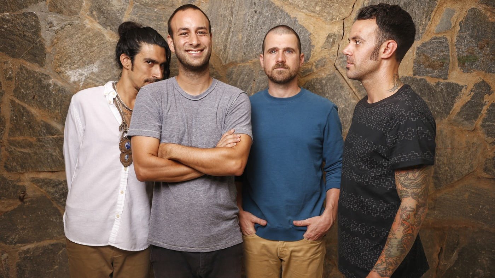

*Brand New*

So, its been a while since all the news about Jesse Lacey came out, and I’ve needed to give myself a bit of time to process this news.

As most of you I’ve been a die hard BN fan since YFW, and even though they don’t play it anymore I’ve matured with the band through Deja, Devil and God, Daisy & finally Science Fiction.

When the news first came out, I was disgusted, shocked and felt sick that I ever loved the band. I didn’t know how to feel looking up to a band and supporting a band all these years and finding out the front man had be accused and possibly done these horrible things.

I thought I’m never listening to Brand New again, I’m getting my tattoos removed, I’m getting rid of all my vinyls and merch everything.

I can say that months on I am still listening to Brand New, have no intentions of getting any of my tattoos removed, selling any of my vinyls etc.

I do not support anything Jesse has been accused of doing, but I’ve been able to seperate the man from the music. This band got me through a lot growing up, and with out them I’m not sure if I’d still be here.

Any Brand New fan can not deny their music is amazing, and its hard to get through a week without pumping Deja or Devil & God. Just because I support the music doesn’t mean I support the alleged actions of the front man.