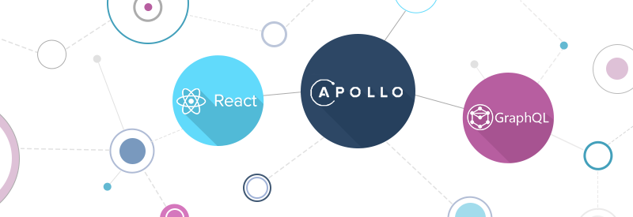
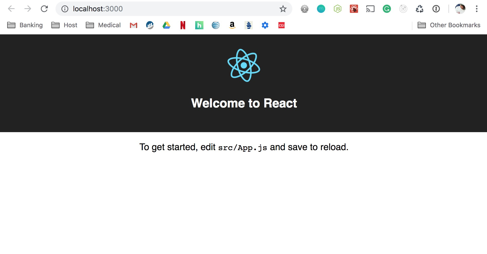

*React + GrahphQL + Apollo*

So you've probably heard a lot about using React with GraphQL and Apollo and heard about how cool it is... Well I've got something to tell you, it is cool, very cool and possibly a game changer for how you manage your state. Will this mean the end of <em>Redux</em> and <em>MobX</em> probably not... so don't stress yet 

I'm going to show you how to how to use React, GraphQL and Apollo with the [Github GraphQL API](https://developer.github.com/v4/). 

<em>[Yelp](https://www.yelp.com/developers/graphql/guides/intro)  also have a public GraphQL API which I haven't used yet, but I'm going to play around with that a little later.</em>

### Getting started

Before we jump into the code, we need to do a few things... 

The first thing you are going to need to do is create a [Personal Access Token](https://blog.github.com/2013-05-16-personal-api-tokens/) within your github account.

Later we are to go create a new React project, we will use [Create React App](https://github.com/facebook/create-react-app). I'f you've not used Create React App before please go and take a look at the repo.

### Let's get the party started!

Before we get too deep into coding we are going to want to play around with some GraphQL awesomeness so we can get a general understanding of it. 

Lets head over to the official [GitHub GraphQL Explorer](https://developer.github.com/v4/explorer/) you'll need to login with your GitHub account. 

Let's just use the example that GitHub give us to begin with to see how powerful GraphQL is, so paste in and press the play button:

```json
query { 
  viewer { 
    login
  }
}
```

You should see the following, but with your username instead of mine. 

```json
{
  "data": {
    "viewer": {
      "login": "johnnyxbell"
    }
  }
}
```

AMAZING right?!?! 🤯 🤯 🤯

Okay, so lets make this a bit more exciting and add a bit more to query, and press play.

```json
query { 
  viewer { 
    login
    bio
    url
    name
    email
    watching(last:5) {
      nodes {
        name
      }
    }
  }
}
```

So I won't paste my result but you will have a bit of detail about your own GitHub account. You might be wondering about what I am going with the `watching` well I am looking at the last 5 repo's I'm watching and returning their names. 

This is cool right! But displaying this information about yourself is not really that useful right? Let's take a look at something a little more interesting.

How about we pull some data from the React.js repo, that would be cool right? Let's paste the following into the query panel. 

```json
{
  repository(owner: "facebook", name: "react") {
    owner {
      login
      avatarUrl
    }
    name
    url
    description
    stargazers {
      totalCount
    }
  }
}
```

We get back... (<em>this was on 09/21/18 so it maybe different when you look</em>)

```json
{
  "data": {
    "repository": {
      "owner": {
        "login": "facebook",
        "avatarUrl": "https://avatars3.githubusercontent.com/u/69631?v=4"
      },
      "name": "react",
      "url": "https://github.com/facebook/react",
      "description": "A declarative, efficient, and flexible JavaScript library for building user interfaces.",
      "stargazers": {
        "totalCount": 111707
      }
    }
  }
}
```

Pretty cool right!?! - So by now you'll notice how powerful GraphQL can be, you tell the API what you want and it returns you the data you need.

By now you should have a general understanding about how GraphQL works. Please play around and pull different data in the explorer, maybe look at your own repo's, or just add to the query string, whatever you like. 

Now we are ready to start actually coding! Fire up your terminal and create a new react app for this project we are about to build out.

`yarn create react-app react-graphql-apollo`

So what we are doing is creating a new react app in the `react-graphql-apollo` directory... Wait for it to do its magic. 

Once its done lets go into our directly and start up the project. 

`cd react-graphql-apollo && yarn start`

You should now see this bad boy pop open:



Now that we have our development environment up and running we are going to want to install our dependencies for our app, so lets run the following:

`yarn add graphql react-apollo apollo-boost`

