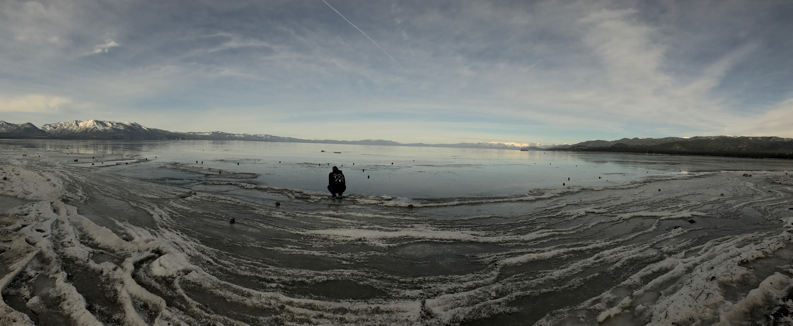

*Lake Tahoe*

Well, its my birthday today 🥳. I just turned 32 and 2019 brings up the milestone of me being a professional software engineer for 10 years. So I thought with these 2 milestones in my life today would be a good day to write a blog about 2018. 

### Work

Well last year I decided to change jobs, I moved from a management role, into a individual contributor role at [StackShare](http://stackshare.io), and I have to say its been the best decision I've made career wise. 

As StackShare is a tool for developers we need to stay ahead of the game tech wise, so probably the most exciting thing that I've changed about my stack would be ditching Redux and Rest for Apollo and GraphQL. Switching to the 2 tools has made my job so fun and I love using them everyday. 

Other than that I'm using the latest React builds and coding some amazing things everyday, and working with the most talented people. 

So last year my career was amazing and I look forward to seeing what 2019 brings at [StackShare](http://stackshare.io). 

### OpenSource

Last year I started thinking a lot about OpenSource, and I made my first contrbution to [Grokking Algorithms](https://github.com/egonSchiele/grokking_algorithms), it wasn't much but it got me super excited about OpenSource. This year I've hit the ground running with being a major contributor to [Netlify Menubar](https://github.com/stefanjudis/netlify-menubar) (if you scroll down you can see my face in the readme). I also added the StackShare logo to [Simple Icons](https://github.com/simple-icons/simple-icons). 

Other then contributing code to OpenSource I've actually started giving back to OpenSource for all the great tools that I use every day, and the people that maintain these tools, you can check out my [OpenCollective](https://opencollective.com/johnnyxbell) to see a little more about who I support.  

We also hired [Justin](https://twitter.com/jdorfman) who is the king of OpenSource, a good friend and a board member og  [OpenCollective](https://opencollective.com/) so with his help this year I'm going to really try to contribute a lot. 

### Devs with Disabilities 

Also last year I started something called [Devs With Disabilities](https://opencollective.com/devs-with-disabilities) its a place for all developers with disabilities (and without - we don't discriminate) like me to come together and chat about our experiences. 

I have a twitter and instagram account for it, but I haven't really done anything else, this year I'll create a website, and a meetup. Hopefully this will allow the group to get more traction and get the community involved. 

### Goals for 2019

I kind of went into my goals for 2019 above, but let me summarize them down here.

- Keep Coding and making cool shit in 2019
- Give back to OpenSource as much as possible
- Keep learning more Apollo and GraphQL
- Improve my algorithms 
- Get DWD off the ground and create a meetup for it
- Speak at a conference 
- Reach over 100 followers on my twitter